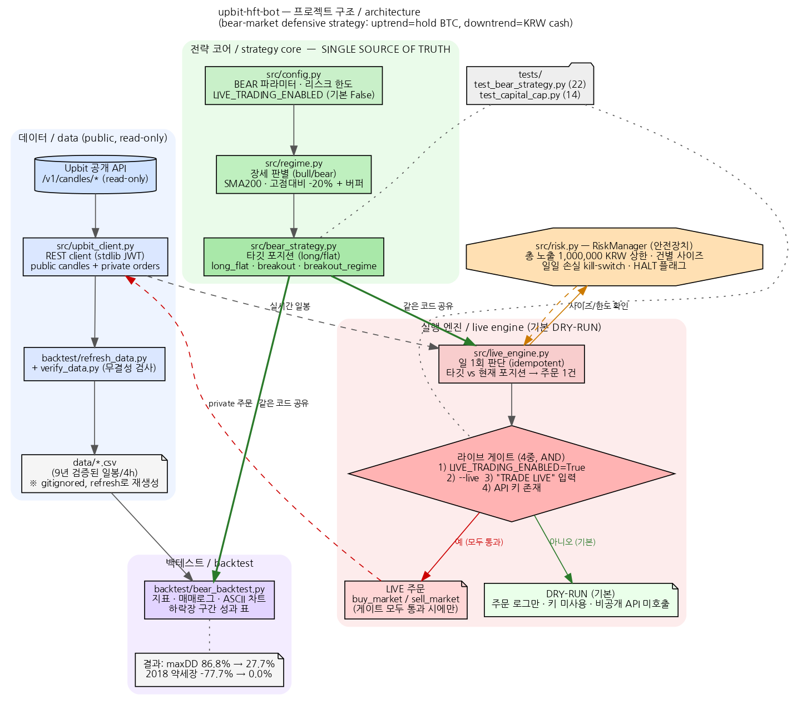

# upbit-hft-bot

업비트 **KRW-BTC** 대상의 트레이딩 연구 프로젝트입니다. **하락장 방어 전략**
(상승장엔 BTC 보유, 하락장엔 원화 현금)을 중심으로, 백테스트와 실행 엔진,
그리고 강한 리스크 한도를 갖춘 파이썬 **표준 라이브러리만**으로 구현되어
있습니다(외부 패키지 없음).

> **상태: 연구/모의(PAPER) 단계.** 기본은 **DRY-RUN(모의)** 이며 실거래는
> 꺼져 있습니다. 실거래는 다중 게이트(아래 "안전장치")를 모두 통과할 때만
> 가능합니다. 아직 계좌에 자금을 넣지 마세요.

## 핵심 전략 (하락장 방어)

- **상승장 = BTC 보유 / 하락장 = 원화 현금.** 수익 극대화가 아니라 **손실
  회피**가 목표입니다(업비트 현물은 공매도 불가).
- **하락장 판단:** 가격이 **200일 이동평균 아래** 이거나, 최근 1년 고점 대비
  **-20% 이상** 하락. 경계에서의 잦은 매매를 막는 **되돌림 버퍼** 포함.
- **백테스트 핵심(9년 일봉):** 최대낙폭 **86.8% → 27.7%**, 2018 약세장
  **-77.7% → 0.0%**. 자세한 내용: [`docs/strategy_report_ko.md`](docs/strategy_report_ko.md).

구조도:



## 폴더 구조

```
src/
  config.py        모든 설정값 + 리스크 한도 + 실거래 마스터 스위치
  regime.py        장세 판별 (200일 MA + 고점대비 -20% 낙폭)
  bear_strategy.py 하락장 방어 전략 로직 (백테스트·실행 엔진이 공유)
  live_engine.py   실행 엔진 — 기본 DRY-RUN, 실거래는 게이트로 잠금
  risk.py          노출 상한 · 건별 사이즈 · 일일 손실 kill-switch
  upbit_client.py  업비트 REST 클라이언트 (표준 라이브러리 JWT)
  bot.py           초기 평균회귀 스캘퍼 (별도 전략, 참고용)
backtest/
  bear_backtest.py 하락장 전략 백테스트 (지표·매매로그·차트·약세장 표)
  refresh_data.py  업비트 공개 API에서 데이터 갱신 + 무결성 검사
research/           설계 노트, 인용 문헌, 연구 로그
docs/               구조도(architecture.png), 전략 보고서(한국어)
OPERATIONS.md       실행/정지, kill-switch, 실거래 전환 체크리스트
```

## 빠른 시작

```bash
# 1) 데이터 갱신 (업비트 공개 API, 키 불필요)
python3 backtest/refresh_data.py

# 2) 하락장 전략 백테스트
python3 backtest/bear_backtest.py

# 3) 실행 엔진 — 기본 DRY-RUN (키 미사용, 실제 주문 없음)
python3 src/live_engine.py
```

## 안전장치 (실거래는 기본 OFF)

실거래 주문은 아래 **4가지가 모두** 참일 때만 발생합니다. 하나라도 빠지면
자동으로 DRY-RUN으로 남아 "낼 주문"만 로그로 기록합니다.

1. `config.LIVE_TRADING_ENABLED = True` (마스터 스위치, 기본 **False**)
2. `--live` 옵션
3. `"TRADE LIVE"` 문구 직접 입력
4. API 키 존재 (`secrets.env`)

**실거래 전환은 코드 수정이 아니라 설정(플래그+키) 변경**으로만 이루어집니다.
리스크 한도(`src/config.py`): 총 노출 **100만 KRW** 상한 · 건별 **20만 KRW** ·
일일 손실 **5만 KRW** kill-switch. 키는 gitignore된 `secrets.env`에서 로드되며
로그에 절대 남지 않습니다. 데이터 파일(`data/*.csv`)은 용량 때문에 저장소에
포함하지 않으며 `refresh_data.py`로 재생성합니다.

## 참고

- 전략 설계·근거·인용 문헌: `research/BEAR_MARKET_STRATEGY.md`
- 운영 방법: `OPERATIONS.md`
- 전략 요약(한국어): `docs/strategy_report_ko.md`
